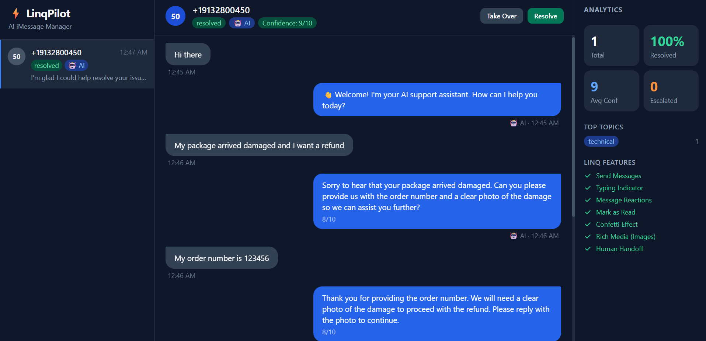

# LinqPilot

iMessage support agent that handles customer queries with AI and knows when to get out of the way and hand off to a human.

---

## The problem it solves

Most webhook examples stop at "receive message, send reply." That's the easy part. The hard part is:
- What happens when the AI doesn't actually know the answer?
- What happens when a customer is frustrated and needs a real person?
- How does a human agent jump in without the conversation falling apart?

LinqPilot is built around that gap. The AI handles what it can, scores its own confidence on every reply, and escalates automatically when it's out of its depth. Human agents get a live dashboard to monitor threads, take over conversations, and send messages — all while the AI keeps handling everything else in parallel.

---

## Features

- [x] **AI auto-replies** via Groq (llama-3.1-8b-instant) — fast responses for common support queries
- [x] **Confidence scoring** — every AI reply gets a 1–10 score; below 6 it escalates automatically
- [x] **Human-in-the-loop** — agents can take over any thread mid-conversation; toggle back to AI when done
- [x] **Real-time dashboard** — three-column UI showing all threads, message history, and live analytics; WebSocket-powered, no polling
- [x] **Typing indicators** — start/stop while the AI is thinking so it feels like a real conversation
- [x] **Message reactions** — emphasize on receipt, like on AI reply
- [x] **Read receipts** — chats marked read immediately on receipt
- [x] **Confetti effect** — fires on genuine resolutions when confidence is high
- [x] **Welcome image** — rich media greeting sent to first-time contacts
- [x] **HMAC-SHA256 webhook verification** — all incoming Linq webhooks are signature-checked

---

## Stack

| Layer | What |
|---|---|
| Runtime | Node.js 24 with built-in `node:sqlite` |
| Server | Express + `ws` (WebSocket) |
| AI | Groq API — `llama-3.1-8b-instant` |
| Language | TypeScript |
| Frontend | Single-file HTML, Tailwind CDN — no build step |

---

## Run it

```bash
# Install dependencies
npm install

# Copy the env template and fill it in
cp .env.example .env

# Start (auto-restarts on save, ignores DB file changes)
npm run dev
```

Open `http://localhost:3001` for the dashboard.

You'll need four env vars:

```
LINQ_API_TOKEN=        # your Linq partner API token
LINQ_PHONE_NUMBER=     # the phone number attached to your Linq account
LINQ_WEBHOOK_SECRET=   # used to verify webhook signatures (optional but recommended)
GROQ_API_KEY=          # from console.groq.com
```

For local development, point your Linq webhook at an ngrok tunnel:

```bash
ngrok http 3001
# paste the https URL into your Linq dashboard as the webhook endpoint
```

---

## How it works

When a message comes in:

1. Linq POSTs to `/webhook`
2. Server sends `200 OK` immediately so Linq doesn't time out, then processes async
3. If it's a first-time contact — send the welcome image and stop. No AI reply needed, the greeting covers it.
4. Otherwise: mark chat read, start typing indicator, add an "emphasize" reaction to the incoming message
5. Last 20 messages + the new one go to Groq. The AI replies with a message, a confidence score (1–10), a topic category, and a suggested action (`respond` / `escalate` / `resolve`)
6. If confidence < 6 or the AI says escalate — flip the conversation to human mode, flag it in the dashboard
7. If confidence is fine — send the reply through Linq. If it's a resolution with confidence ≥ 8, add confetti
8. Dashboard gets a WebSocket push and updates in real time

The dashboard lets agents read all threads, take over (or hand back to AI), type and send messages directly, and manually mark things resolved. Analytics — resolution rate, avg confidence, escalation count, topic breakdown — are calculated on the fly from SQLite.

---

## Screenshot



*(three-column layout: conversation list on left, message thread in center, analytics on right)*
